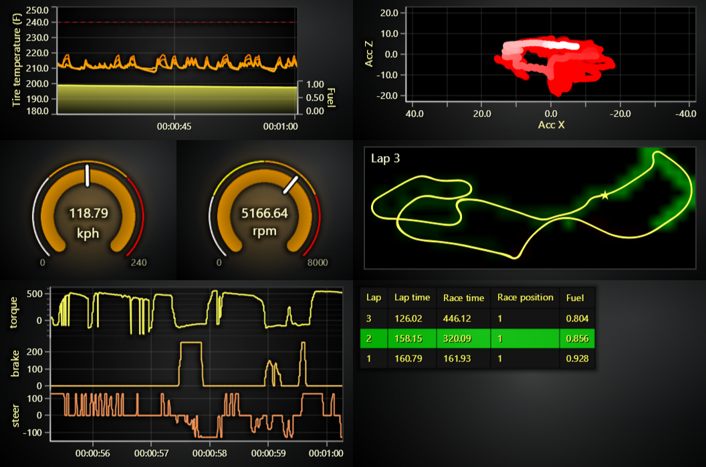

# JavaScript Racing Dashboard

This demo application belongs to the set of examples for LightningChart JS, data visualization library for JavaScript.

LightningChart JS is entirely GPU accelerated and performance optimized charting library for presenting massive amounts of data. It offers an easy way of creating sophisticated and interactive charts and adding them to your website or web application.

The demo can be used as an example or a seed project. Local execution requires the following steps:

-   Make sure that relevant version of [Node.js](https://nodejs.org/en/download/) is installed
-   Open the project folder in a terminal:

          npm install              # fetches dependencies
          npm start                # builds an application and starts the development server

-   The application is available at _http://localhost:8080_ in your browser, webpack-dev-server provides hot reload functionality.

## Description

Motorsports industry inspired example of using LightningChart JS.
A dashboard consuming playback data from a multi-lap sports car race, displaying information such as:

-   torque
-   brake
-   steering
-   speed
-   engine rounds per minute
-   tire temperatures
-   fuel
-   accelerations along XZ planes
-   current lap time
-   race position

LightningChart JS excels at applications for industries like motorsports due to the large amount of different data properties plotted across a shared time window.
Regardless whether the use case is real-time monitoring or playing back old recordings, the use case is equally demanding.

This example combines several visualization types in same view:

-   Line series to display torque, brake, steer with a fast 5 second scrolling time window.
-   Two gauges to display speed and engine revolutions.
-   Dynamically colored line series for tire temperatures (hot temperatures show as orange/red).
-   Dynamically colored, fading over time scatter series for XZ accelerations (new samples show as bright white, old samples fade away)
-   Freeform line series to display race track along with a moving marker for the current racer position.
    -   A heatmap under this line series displays time loss relative to last lap (red = time lost, green = time gain)
-   And finally a data grid for displaying per-lap information, lap times, positions and fuel levels.

## API Links

* [Dashboard]
* [XY cartesian chart]
* [Line series]
* [Axis]
* [Axis tick strategies]
* [Axis scroll strategies]

## Support

If you notice an error in the example code, please open an issue on [GitHub][0] repository of the entire example.

Official [API documentation][1] can be found on [LightningChart][2] website.

If the docs and other materials do not solve your problem as well as implementation help is needed, ask on [StackOverflow][3] (tagged lightningchart).

If you think you found a bug in the LightningChart JavaScript library, please contact sales@lightningchart.com.

Direct developer email support can be purchased through a [Support Plan][4] or by contacting sales@lightningchart.com.

[0]: https://github.com/Arction/
[1]: https://lightningchart.com/lightningchart-js-api-documentation/
[2]: https://lightningchart.com
[3]: https://stackoverflow.com/questions/tagged/lightningchart
[4]: https://lightningchart.com/support-services/

© LightningChart Ltd 2009-2022. All rights reserved.

[Dashboard]: https://lightningchart.com/js-charts/api-documentation/v7.1.0/classes/Dashboard.html
[XY cartesian chart]: https://lightningchart.com/js-charts/api-documentation/v7.1.0/classes/ChartXY.html
[Line series]: https://lightningchart.com/js-charts/api-documentation/v7.1.0/
[Axis]: https://lightningchart.com/js-charts/api-documentation/v7.1.0/classes/Axis.html
[Axis tick strategies]: https://lightningchart.com/js-charts/api-documentation/v7.1.0/variables/AxisTickStrategies.html
[Axis scroll strategies]: https://lightningchart.com/js-charts/api-documentation/v7.1.0/variables/AxisScrollStrategies.html

